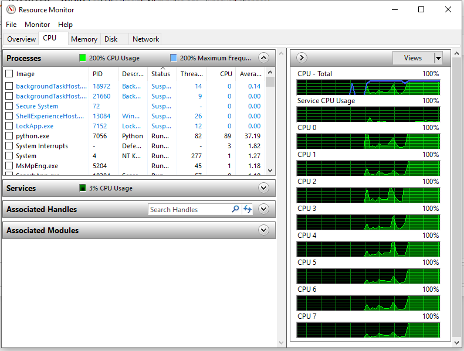
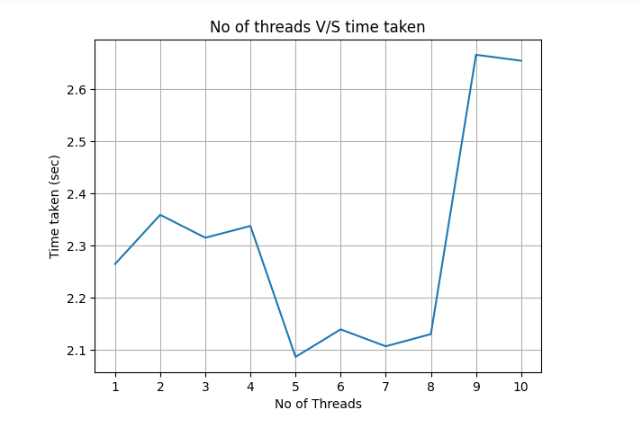
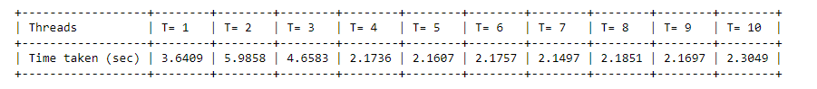

# Mutli-Threading Assignment

### OBJECTIVE:
To perform multiplication of 100 matrices of size 1000 X 1000 with varying number of threads and generate visual data representations of time taken and cpu usage.

### RESULTS:
#### CPU usage-

#### Number of threads v/s Time Taken-

It is observed that the minimum time is taken when the the number of threads are 4.